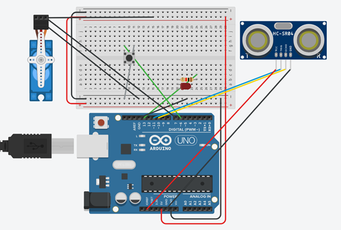
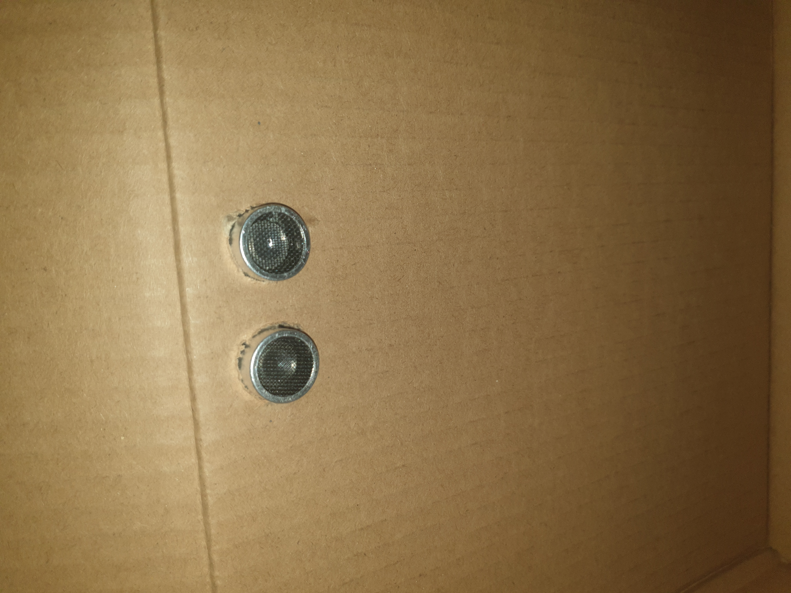

# smart-waste-classification
a smart bin that classifies waste into organic and non-organic waste.

# About This Project

A smart waste segregation system that can automatically classify waste items into organic and recyclable compartments. It uses computer vision and machine learning to identify waste items and actuate a bin lid to the correct waste compartment.

An Arduino board controls the hardware including a servo motor to move the bin lid and an ultrasonic sensor to detect when the bin is full. Python program handles the computer vision and machine learning tasks and communicates with the Arduino over serial communication.

# Built with
- Python
- TensorFlow
- Keras
- OpenCV
- Arduino UNO

# Features
## Camera
Used a phone's camera to capture images of waste items, but a small camera would have been more suitable.

## Sensor
An ultrasonic sensor, to detect when the bin is full.
 

# Demo
## An organic waste being disposed into the organic compartment.
 

# Acknowledgments
[Image Dataset](https://www.kaggle.com/datasets/techsash/waste-classification-data)

